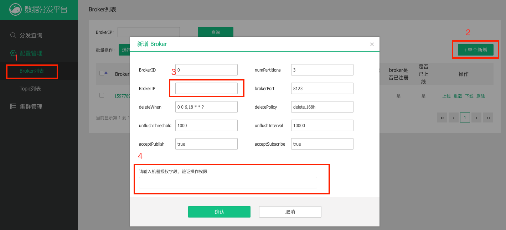

## 准备工作

- Java 1.7 或 1.8(Java 9 及以上，未经测试验证)
- Maven 3.* 及以上

## 构建

### 从下载的发行版代码包构建
在TubeMQ根目录下执行命令：
```bash
mvn clean package -DskipTests
```
在根目录执行 `mvn clean install` 之后，可以单独对每个 module 进行构建。
### 基于源代码构建
在IDE中构建和调试源码，需要先运行以下命令：
```bash
mvn compile
```
执行之后，会生成 `protoc` 文件对应的 java source file，位于 `target/generated-sources` 目录。

然后就可以在 IDE 中打开 TubeMQ 工程。

你可以跳到 下一章 部署运行 ， 除非你准备自己编译proto 文件。（通常不需要，mvn会自动下载protoc 构建)。

如果你打算使用本地的 `protoc` 可执行文件，你可以修改 `tubemq-core/pom.xml` 下的 `protobuf-maven-plugin` 的配置，如下所示。

```xml
<configuration>
    <outputDirectory>${project.build.directory}/generated-sources/java</outputDirectory>
    <protocExecutable>/usr/local/bin/protoc</protocExecutable>
</configuration>
```
## 部署运行
构建完成之后，在 `tubemq-server/target` 目录下会有 **tubemq-server-x.x.x-bin.tar.gz** 文件. 
这是 Server 的部署包，包含了脚本、配置文件、依赖以及 web GUI相关的内容。

首次部署，只需要解压部署包，解压之后的目录结构如下：

```
/opt/tubemq-server
├── bin
├── conf
├── lib
├── logs
└── resources
```
### 配置
TubeMQ 集群有两个角色: **Master** 和 **Broker**. Master 和 Broker 可以部署在相同或者不同的节点上。下面是
一个集群的配置示例：

| Role | TCP Port | TLS Port | Web Port | Comment |
| ---- | -------- | -------- | -------- | ------- |
| Master | 8099 | 8199 | 8080 | 元数据存储在 /stage/metadata |
| Broker | 8123 | 8124 | 8081 | 消息存储在 /stage/msgdata |
| Zookeeper | 2181 | | | Offset 存储在 /tubemq |

详细的配置信息如下所示，注意将 `YOUR_SERVER_IP` 替换为真实的IP。

#### master.ini
```ini
[master]
hostName=YOUR_SERVER_IP
port=8000
webPort=8080
consumerBalancePeriodMs=30000
firstBalanceDelayAfterStartMs=60000
consumerHeartbeatTimeoutMs=30000
producerHeartbeatTimeoutMs=45000
brokerHeartbeatTimeoutMs=25000
confModAuthToken=abc
webResourcePath=/opt/tubemq-server/resources

[zookeeper]
zkNodeRoot=/tubemq
zkServerAddr=localhost:2181
zkSessionTimeoutMs=30000
zkConnectionTimeoutMs=30000
zkSyncTimeMs=5000
zkCommitPeriodMs=5000

[replication]
; name of current node; MUST BE DIFFERENT for every node in the cluster
repNodeName=tubemqMasterGroupNode1
; helperHost(and port) for nodes to join master cluster
repHelperHost=YOUR_SERVER_IP:9001
```

##### resources/velocity.properties
```properties
resource.loader=file
file.resource.loader.description=Velocity File Resource Loader
file.resource.loader.class=org.apache.velocity.runtime.resource.loader.FileResourceLoader
file.resource.loader.path=/opt/tubemq-server/resources/templates
file.resource.loader.cache=false
file.resource.loader.modificationCheckInterval=2
string.resource.loader.description=Velocity String Resource Loader
string.resource.loader.class=org.apache.velocity.runtime.resource.loader.StringResourceLoader
input.encoding=UTF-8
output.encoding=UTF-8
```

##### conf/broker.ini
```ini
[broker]
brokerId=0
hostName=YOUR_SERVER_IP
port=8123
webPort=8081
masterAddressList=YOUR_SERVER_IP:8000
primaryPath=/stage/msgdata
maxSegmentSize=1073741824
maxIndexSegmentSize=22020096
transferSize= 524288
loadMessageStoresInParallel=true
consumerRegTimeoutMs=35000

[zookeeper]
zkNodeRoot=/tubemq
zkServerAddr=localhost:2181
zkSessionTimeoutMs=30000
zkConnectionTimeoutMs=30000
zkSyncTimeMs=5000
zkCommitPeriodMs=5000
zkCommitFailRetries=10

```

特别的，对于 Master 节点，需要在 `/etc/hosts` 中配置其他 Master 节点的信息，如果 Master 节点的IP地址为`192.168.1.2`：
```
192.168.1.2 192-168-1-2
```

## 高可用性介紹

在上面的例子中，我们在单个节点上运行服务。然而，在实际的生产环境中，
你需要在不同的服务器上运行多个 Master 服务以达到高可用性的目的。
下面是可用性级别的介绍：

| HA级别 | Master数量 | 描述 |
| -------- | ------------- | ----------- |
| 高 | 3 masters | 任何主节点崩溃后，集群元数据仍处于读/写状态，可以接受新的生产者/消费者。 |
| 中 | 2 masters | 一个主节点崩溃后，集群元数据处于只读状态。对现有的生产者和消费者没有任何影响。 |
| 低 | 1 master | 主节点崩溃后，对现有的生产者和消费者没有影响。 |

请注意，主服务器的时钟应该是同步的。

## 启动集群

配置完成之后，就可以按照以下步骤启动集群。

### 启动主节点

完成如上配置设置后，首先进入主备Master所在的TubeMQ环境的 `bin` 目录，进行服务启动操作。
```bash
./tubemq master start
```

访问Master的管控台 `http://your-master-ip:8080` ，页面可查则表示 master 已成功启动。


## 启动代理
Broker启动前，首先要在Master上配置Broker元数据，增加Broker相关的管理信息。

在`Broker List` 页面,  `Add Single Broker`，然后填写相关信息。



需要填写的内容包括：
1. broker IP: broker server ip
2. authToken:  `conf/master.ini` 文件中 `confModAuthToken` 字段配置的 token

然后上线Broker：


到 Broker 节点的 `bin` 目录下，执行以下命令启动 Broker服务：

```bash
./tubemq broker start
```

刷新页面可以看到 Broker 已经注册，当 `当前运行子状态` 为 `idle` 时， 可以增加topic。


## 新增 Topic
可以通过 web GUI 添加 Topic， 在 `Topic列表`页面添加，需要填写相关信息


然后选择部署 Topic 的 Broker


此时 Broker的 `可发布` 和 `可订阅` 依旧是灰色的


需要在 `Broker列表`页面重载Broker 配置


之后就可以在页面查看Topic信息。


## 运行示例
可以使用 Example 来测试集群。首先，我们运行 producer的demo，注意将 `YOUR_SERVER_IP` 替换为实际的IP（例如：localhost）
```bash
java -Dlog4j.configuration=file:/opt/tubemq-server/conf/tools.log4j.properties  \
-Djava.net.preferIPv4Stack=true -cp  /opt/tubemq-server/lib/*:/opt/tubemq-server/conf/* \
org.apache.tubemq.example.MessageProducerExample \
YOUR_SERVER_IP:8000 demo 10000000
```
从日志我们可以看到，数据发送成功
```bash
[2020-06-04 11:19:04,405] INFO Send demo 1000 message, keyCount is 252 (org.apache.tubemq.example.MessageProducerExample)
[2020-06-04 11:19:04,652] INFO Send demo 2000 message, keyCount is 502 (org.apache.tubemq.example.MessageProducerExample)
[2020-06-04 11:19:05,096] INFO Send demo 3000 message, keyCount is 752 (org.apache.tubemq.example.MessageProducerExample)
[2020-06-04 11:19:05,181] INFO Send demo 4000 message, keyCount is 1002 (org.apache.tubemq.example.MessageProducerExample)
```

然后运行 consume 的 demo，`YOUR_SERVER_IP` 也需要替换（例如： localhost）
```bash
java -Xmx512m -Dlog4j.configuration=file:/opt/tubemq-server/conf/tools.log4j.properties \
-Djava.net.preferIPv4Stack=true -cp /opt/tubemq-server/lib/*:/opt/tubemq-server/conf/* \
org.apache.tubemq.example.MessageConsumerExample \
YOUR_SERVER_IP:8000 demo demoGroup 3 1 1
```
从日志我们可以看到，数据被消费者消费到

```bash
[2020-06-04 11:20:29,107] INFO Receive messages:270000 (org.apache.tubemq.example.MsgRecvStats)
[2020-06-04 11:20:31,206] INFO Receive messages:272500 (org.apache.tubemq.example.MsgRecvStats)
[2020-06-04 11:20:31,590] INFO Receive messages:275000 (org.apache.tubemq.example.MsgRecvStats)
[2020-06-04 11:20:31,910] INFO Receive messages:277500 (org.apache.tubemq.example.MsgRecvStats)
```

---


