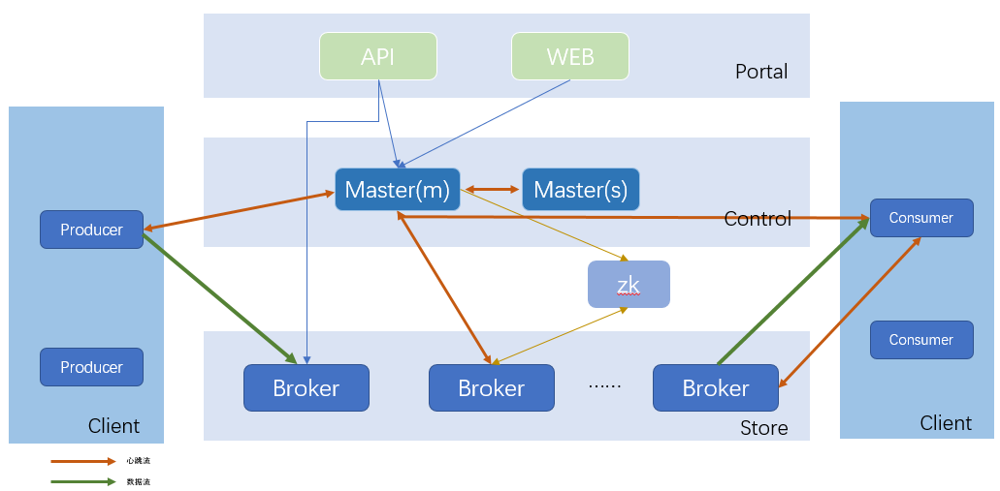
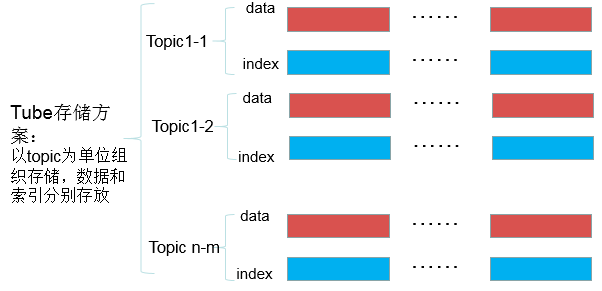
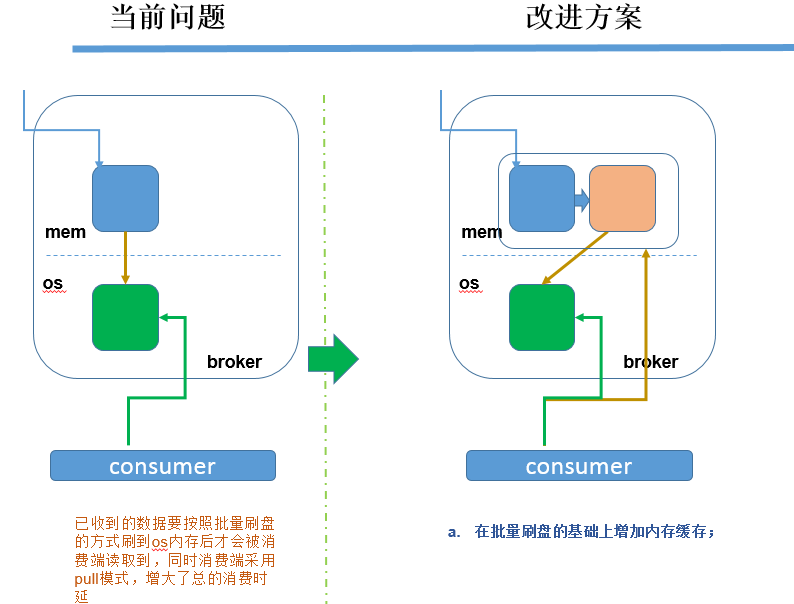

## TubeMQ Architecture： ##
After years of evolution, the TubeMQ cluster is divided into the following 5 parts: 

- **Portal：** The Portal part responsible for external interaction and maintenance operations, including API and Web. The API connects to the management system outside the cluster. The Web is a page encapsulation of daily operation and maintenance functions based on the API;

- **Master：** It is responsible for the Control part of the cluster. This part is composed of one or more Master nodes. Master HA performs heartbeat keep-alive and real-time hot standby switching between master nodes (This is the reason why everyone needs to fill in the addresses of all Master nodes corresponding to the cluster when using TubeMQ Lib). The main master is responsible for managing the status of the entire cluster, resource scheduling, permission checking, metadata query, etc;

- **Broker：** The Store part responsible for data storage. This part is composed of independent Broker nodes. Each Broker node manages the Topic set in this node, including the addition, deletion, modification, and inquiring about Topics. It is also responsible for message storage, consumption, aging, partition expansion, data consumption offset records, etc. on the topic, and the external capabilities of the cluster, including the number of topics, throughput, and capacity, are completed by horizontally expanding the broker node;

- **Client：** The Client part responsible for data production and consumption. We provide this part in the form of Lib. The most commonly used is the consumer. Compared with the previous, the consumer now supports Push and Pull data pull modes, data consumption behavior support both order and filtered consumption. For the Pull consumption mode, the service supports resetting the precise offset through the client to support the business extract-once consumption. At the same time, the consumer  has launched a new cross-cluster switch-free BidConsumer client;

- **Zookeeper：** Responsible for the zk part of the offset storage. This part of the function has been weakened to only the persistent storage of the offset. Considering the next multi-node copy function, this module is temporarily reserved;

## Broker File Storage Scheme Improvement： ##
Systems that use disk as a medium for data persistence are faced with a variety of performance issues caused by disk problems,TubeMQ is no exception. Performance improvements are largely addressed to solve the problem of how message data is read, write and stored. In this respect, TubeMQ has made some improvements:

1. **File structure and organization adjustment:** TubeMQ's disk storage scheme is similar to Kafka, but not the same, as the figure shown below. Storage instance is consisted of an index file and a data file, each topic can allocate one or more storage instances. And each topic separately maintains the mechanisms of managing storage instances, including aging cycles, number of partitions, whether readable or writable, etc.

2. **Memory block cache:** We add an additional memory cache block for each storage instance based on the file storage, i.e. add a piece of memory to the original write disk to isolate the slow impact of hard disk. The data is brushed into memory first, and the memory control block then brushes the data to disk files in bulk.

